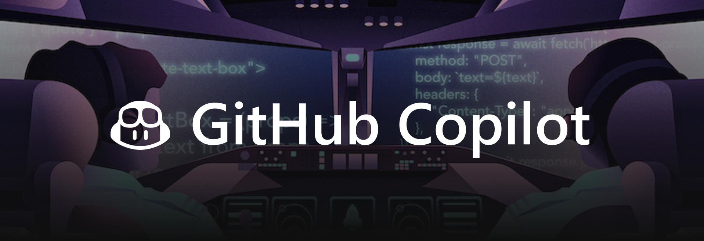

 

# 📂 コンテンツ

**GitHub Copilot Global Bootcamp** は、参加者が実際に手を動かして学ぶ体験型イベントです。内容は GitHub の基礎から GitHub Copilot の高度な機能まで、3つのモジュールに分かれています。各モジュールは**30～45分**で完了でき、全体で**2.5～3時間**の構成です。

この content フォルダーには、各モジュールの**プレゼンテーションスライド**とハンズオンラボのリストが含まれています。参加者のスキルや興味に合わせてラボを選択できます。

アジェンダ例：

|       |              コンテンツ             |                       学習内容                       |                     学習目標                 |
| :---: | :------------------------------------: | :---------------------------------------------------------: | ----------------------------------------------------------- |
| 01 | [GitHub 入門](/01-Introduction-to-GitHub/) | 1時間以内で GitHub を使い始めよう | リポジトリ、ブランチ、コミット、プルリクエストの基礎を学ぶ |
| 02 | [GitHub Codespaces 入門](/02-Introduction-to-GitHub-Codespaces/) | GitHub Codespaces と Visual Studio Code で開発しよう | Codespace の作成、コードのプッシュ、カスタムイメージの選択、Codespace のカスタマイズ方法 |
| 03 | [GitHub Copilot 入門](/03-Introduction-to-GitHub-Copilot/) | GitHub Copilot は VS Code や Codespaces で自動補完型の提案を行い、コーディングを支援します | GitHub Copilot の機能を体験する |

## ラボ
ワークショップを充実させるための実践的なリソースを紹介します。ここでは Microsoft Learn のインタラクティブなトレーニングや、GitHub Copilot のスキルを伸ばすハンズオン演習付きリポジトリを掲載しています。

### Microsoft Learn 

| タイトル | レベル | 説明 |
|---|---|---|
| [GitHub Copilot の高度な機能を使う](https://learn.microsoft.com/ja-jp/training/modules/advanced-github-copilot/) | 初級 |  |
| [JavaScript で GitHub Copilot を使う](https://learn.microsoft.com/ja-jp/training/modules/introduction-copilot-javascript/) | 初級 |  |
| [Python で GitHub Copilot を使う](https://learn.microsoft.com/ja-jp/training/modules/introduction-copilot-python/) | 初級 |  |
| [GitHub Copilot を使った AI 活用事例](https://learn.microsoft.com/ja-jp/training/modules/developer-use-cases-for-ai-with-github-copilot/) | 中級 |  |
| [GitHub Copilot ツールでドキュメントを生成する](https://learn.microsoft.com/ja-jp/training/modules/generate-documentation-using-github-copilot-tools/) | 中級 |  |
| [GitHub Copilot ツールでコード機能を開発する](https://learn.microsoft.com/ja-jp/training/modules/develop-code-features-using-github-copilot-tools/) | 中級 |  |
| [GitHub Copilot ツールでコード改善を実装する](https://learn.microsoft.com/ja-jp/training/modules/implement-code-improvements-using-github-copilot-tools/) | 中級 |  |
| [GitHub Copilot エージェントモードでアプリケーションを構築する](https://learn.microsoft.com/training/modules/github-copilot-agent-mode/) | 中級 |  |

### 学習用 GitHub リポジトリ
 
実践的な内容とインタラクティブな演習を提供するパブリックワークショップ集：

| リポジトリ | 説明 |
|------------|-------------|
| [Python API を Rust へ GitHub Copilot で移行](https://github.com/microsoft/github-copilot-migrating-languages/tree/main) | GitHub Copilot を使ってアプリケーションを別のプログラミング言語へ移行します。 |
| [Python プロジェクトを GitHub Copilot でアップグレード](https://github.com/microsoft/github-copilot-upgrading) | レガシーな Python プロジェクトを GitHub Copilot でアップグレードします。 |
| [ペアプログラミングのための GitHub Copilot 活用](https://github.com/microsoft/Mastering-GitHub-Copilot-for-Paired-Programming) | AIペアプログラミングリソースとして Copilot を活用するための全11レッスンコース。 |
| [C#/.NET 開発者向け GitHub Copilot 活用](https://github.com/microsoft/mastering-github-copilot-for-dotnet-csharp-developers) | C#/.NET 開発で Copilot を使いこなすカリキュラム。AIペアプログラミングやワークフロー最適化、効率的なコーディングを学びます。 |
| [GitHub Copilot で SQL に挑戦](https://github.com/microsoft/challenging-github-copilot) | Copilot の限界に挑戦し、より良いプロンプト作成を学ぶデモプロジェクト。 |
| [Generative AI for Beginners](https://aka.ms/genai-beginners) | 21レッスン、生成AIの基礎から実践まで。 |
| [Generative AI for Beginners .NET](https://github.com/microsoft/Generative-AI-for-beginners-dotnet) | 5レッスン、.NETアプリケーションでAIを本格活用。 |
| [JavaScript で学ぶ生成AI](https://github.com/microsoft/generative-ai-with-javascript) | 歴史上の偉人と出会いながら生成AI技術を学ぶタイムトラベル型教材！ |
| [Web開発入門](https://aka.ms/webdev-beginners) | 24レッスン、12週間でWeb開発を基礎から学ぶ。 |
| [Choose Your Own Copilot Adventure](https://github.com/microsoft/CopilotAdventures) | Copilot コーディングアドベンチャー。 |
